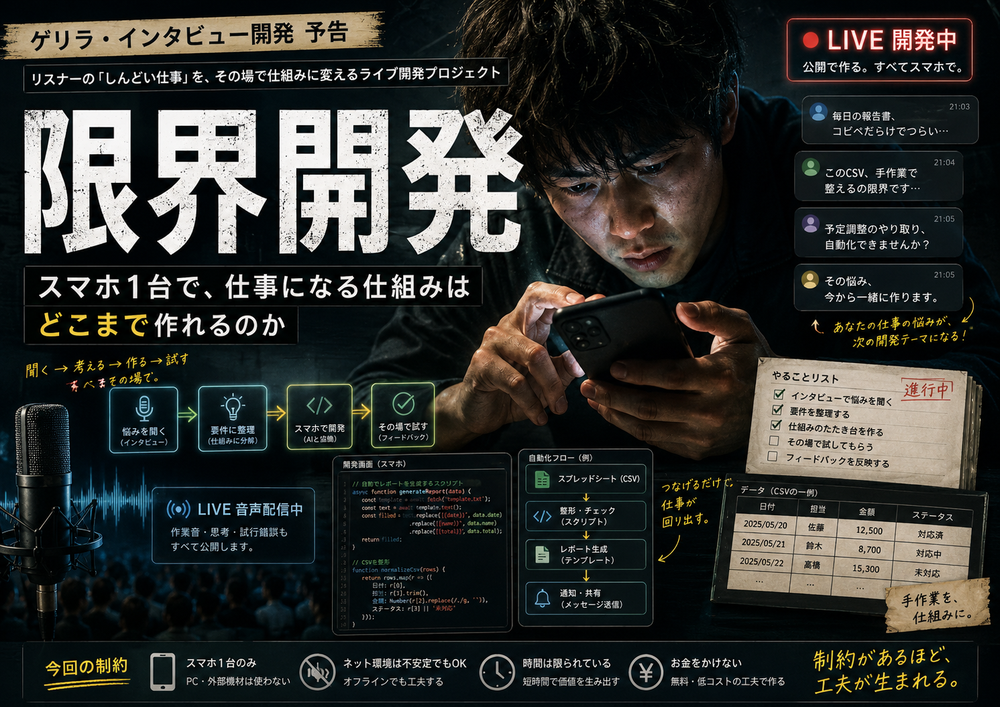

# 限界開発

> **公式ページ**  
> https://nobutakayamauchi.github.io/RS-AI-limit-development/



## 限界開発とは

限界開発は、**スマートフォン1台しか持たず、精神・肉体・金銭・時間・生活上の問題を抱え、プログラム素人である人間が、AIと根性だけで生活をぶん回す仕組みを作る社会実験**です。

この定義は、開発環境が進化しても変わりません。

RTS、Vlog Wizard、デバッグエンジン、Obsidian、GitHub、クラウド、Knowledge Bridgeは限界開発そのものではありません。生活と仕事を止めないために必要になり、その都度生えてきた**生命維持設備**です。

> **限界は完成条件ではなく、開始条件。**

## 何を検証しているのか

生活が安定してから開発するのではありません。制約がある状態を前提に、AIを相談相手、設計補助、実装補助、監査役、記録係として使い、今日の詰まりを一つずつ仕組みに変えます。

完成品だけを残す企画でもありません。

- 何に困ったか
- 何を判断したか
- 何を作らないと決めたか
- どこで壊れたか
- 何が未確認か
- どの実装が本当に動いているか
- どう直し、どう再開したか
- 仕事・収入・生活へどう接続したか

まで残します。

## 開始条件

- 実質スマートフォン1台
- PC、高額機材、大きな初期投資を前提にしない
- 心身の状態が安定しているとは限らない
- 長時間集中できるとは限らない
- 無料枠や弱いサーバーを使うことがある
- プログラム素人から始める
- それでも生活と仕事は待ってくれない

限界は例外処理ではなく、最初から設計条件へ入れます。

## 社会実験プロトコル

1. **困る** — 生活や仕事の詰まりを観測する。
2. **AIと分解する** — 感情、事実、作業、判断、制約を分ける。
3. **文脈を切る** — 今回必要な情報だけを正しいAI・正しい場所へ渡す。
4. **最小の仕組みにする** — 今日の詰まりを一つ減らす道具や手順を作る。
5. **自分の生活で使う** — 実プロジェクトで壊し、観測し、直す。
6. **証拠にする** — 確認済み、壊れている、古い、未確認を分離する。
7. **知識として残す** — 成功だけでなく失敗、停止、復帰方法も凍結する。
8. **生活へ戻す** — 技術を仕事・収入・生存へ接続する。

## 現在の開発環境

初期の限界開発は「スマホからAIへ指示して作る」が中心でした。現在は、**AIへ何を読ませ、何を読ませず、何を証拠として扱うか**まで設計します。

```text
スマートフォン / 人間
        ↓
Idea / Problem
        ↓
Context Routing
        ↓
Human Routing Decision
        ↓
Design Bundle
        ↓
Real Project
        ↓
Deployment Identity Gate
        ↓
Observation
AS_BUILT / BROKEN / STALE / UNOBSERVED
        ↓
Debug Link → Lifecycle → City Release
        ↓
Human Release Decision
```

詳しくは [現行開発アーキテクチャ](docs/current-development-architecture.md) を参照してください。

## 文脈設計

AIを強くするだけでは、長期開発は安定しません。長い会話、古いコード、別プロジェクト、過去の仕様を全部一緒に読むと、誤認が増えます。

そこで限界開発では、次を分離します。

- 正本の仕様
- 完了して凍結した知識
- 今回必要な差分
- 実プロジェクトの観測
- AIの提案
- 人間の判断
- 未確認事項

**AIが読む世界を設計すること**を、現在の限界開発の中核技術として扱います。

## Deployment Identity

実dogfoodで、存在する古いコードを実稼働と誤認しかける問題が見つかりました。

現在はruntimeを分類する前に、service、working directory、entrypoint/module、active route surface、revision等からDeployment Identityを確認します。

> **Deployment Identity MUST be established before runtime implementation classification.**

> **Code existence != runtime evidence.**

コードがあることと、今それが動いていることは別です。

## ここから生えたもの

### RTS

仕様、判断、ルーティング、実プロジェクト観測、Lifecycle、Release判断を分離し、人間判断境界を守る共通基盤です。

### Knowledge Bridge / FREEZER / Obsidian

完了した知識を凍結し、必要な文脈だけを再利用する記憶層です。全面自動書き換えではなく、候補を正しい場所へルーティングし、人間判断を残します。

### Vlog Wizard

既存の動画編集ソフトで詰まったため、「撮る、並べる、喋る、確認する、出す」をスマホ中心で通すために生えた制作基盤です。

### 限界開発式デバッグエンジン

一度踏んだ不具合を、再現シナリオ、回帰テスト、共通知識へ変換する仕組みです。

### 視覚ナビゲーションマップ

画面と操作の接続を可視化します。ただし静的なコード・画面の存在をruntime evidenceとは扱いません。

## 証拠の扱い

実装候補が見つかっても、存在だけでは完成・故障と判定しません。

- `AS_BUILT` — 実装・稼働を証拠で確認
- `BROKEN` — 対象runtimeで壊れている証拠あり
- `STALE` — 古い、非稼働、重複した実装
- `UNOBSERVED` — まだ確認していない

未確認を成功扱いしないことも品質です。

## 人間が最後に持つもの

AIやRTSは、観測や候補を出しても勝手に次の境界を越えません。

- routing decision
- approval
- implementation authorization
- release decision

**Observationは修復命令ではありません。** 証拠から判断する責任は、人間側に残します。

## 「成功」の定義

立派なプロダクト完成だけが成功ではありません。

- 今日の作業が一つ減った
- 途中で止まっても再開できた
- 同じ失敗を人間が二度踏まなくてよくなった
- 古いコードと実稼働を区別できた
- 未確認を未確認のまま残せた
- 他人が同じ工程を追試できた
- 仕事や収入につながる接点が増えた
- 生活を一日長く維持できた

これらも限界開発の成果です。

## 成功物語にはしない

動いていないものは未確認、失敗したものは失敗、古いものはSTALE、生活上の理由で止まったものは停止として残します。

同時に、限界状態や苦痛を美化する企画でもありません。安全線を引きながら、生存可能性と再開可能性を増やすための社会実験です。

## リポジトリ構成

```text
RS-AI-limit-development/
├─ README.md
├─ SAFETY.md
├─ index.html
├─ docs/
│  ├─ specification.md
│  ├─ current-development-architecture.md
│  ├─ build-guide.md
│  ├─ reproduction-environment.md
│  ├─ rts-integration.md
│  └─ debug-engine.md
├─ episodes/       # その時点の実験記録。後から歴史を書き換えない
├─ publications/   # 公開記録
├─ templates/      # 再利用する仕様・テスト・引き継ぎ
└─ tools/          # 限界状態を支える共通ツール
```

## ドキュメント

- [ドキュメントセンター](docs/)
- [限界開発 仕様書](docs/specification.md)
- [現行開発アーキテクチャ](docs/current-development-architecture.md)
- [構築手順](docs/build-guide.md)
- [再現環境](docs/reproduction-environment.md)
- [RTSとの接続](docs/rts-integration.md)
- [デバッグエンジン](docs/debug-engine.md)
- [安全基準](SAFETY.md)

## 歴史記録について

過去Episodeは、その時点で実際に行った内容の証拠です。現在のRTSやDeployment Identity Gateを、過去に使っていなかったEpisodeへ後付けして「実施済み」とは書き換えません。

現在のプロトコルと歴史的な実験記録を分けることも、Evidence Firstの一部です。

## 運営

RS AI / 山内 延天

## ライセンス

現時点ではライセンスを付与していません。公開コードや文書を利用、改変、再配布する権利は自動的には付与されません。
